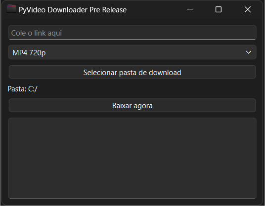
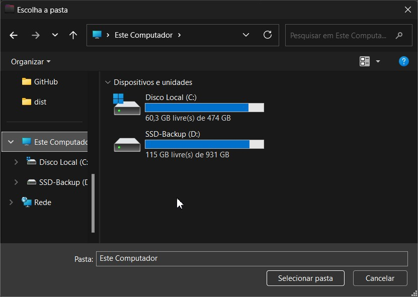
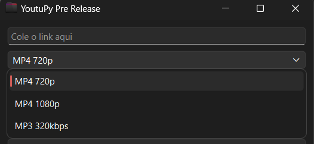
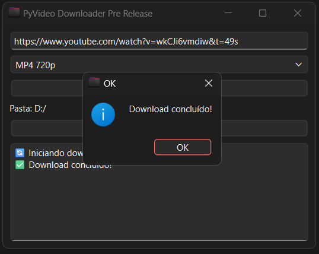

# 🇧🇷 Português

# 📖 Sobre o Projeto

O **PyVideo Downloader** é uma aplicação desktop desenvolvida em **Python** utilizando **PySide6**, criada para fornecer uma interface gráfica simples, moderna e intuitiva para download de vídeos e áudios por meio da biblioteca **yt-dlp**.

O objetivo do projeto é facilitar o processo de download de conteúdos disponíveis em plataformas suportadas pelo **yt-dlp**, permitindo que o usuário escolha o formato desejado, defina a pasta de destino e acompanhe a execução do download de maneira prática.

A aplicação oferece suporte à conversão de áudio para **MP3** e à junção de faixas de vídeo e áudio utilizando o **FFmpeg**, proporcionando arquivos finais compatíveis com os formatos mais utilizados atualmente.

Este projeto foi desenvolvido como parte do meu portfólio profissional com o objetivo de demonstrar conhecimentos em:

* Desenvolvimento de aplicações desktop com Python;
* Construção de interfaces gráficas utilizando PySide6 (Qt);
* Integração com bibliotecas de terceiros;
* Manipulação de arquivos e diretórios;
* Empacotamento de aplicações para Windows;
* Boas práticas de organização de código e documentação.

Além de servir como uma ferramenta útil, o projeto representa a aplicação prática de conceitos de desenvolvimento de software, integração entre componentes e experiência do usuário (UX), buscando entregar uma aplicação leve, funcional e de fácil utilização.

---

# ✨ Principais Recursos

✔ Interface gráfica desenvolvida com PySide6

✔ Download de vídeos em formato MP4

✔ Download de áudio em formato MP3

✔ Suporte para qualidade 720p

✔ Suporte para qualidade 1080p (quando disponível)

✔ Conversão automática utilizando FFmpeg

✔ Escolha da pasta de download

✔ Registro das operações em tempo real

✔ Interface simples e intuitiva

✔ Código-fonte organizado e de fácil manutenção

✔ Projeto open source para fins educacionais e de portfólio

# 🚀 Como Funciona

O **PyVideo Downloader** foi desenvolvido para tornar o processo de download de mídias simples, intuitivo e confiável. A aplicação atua como uma interface gráfica para a biblioteca **yt-dlp**, automatizando as etapas necessárias para baixar, converter e organizar os arquivos.

Todo o processamento é realizado localmente no computador do usuário.

---

## 1. Inserção da URL

O usuário informa a URL do conteúdo desejado em uma plataforma compatível com o **yt-dlp**.

A aplicação valida se uma URL foi fornecida antes de iniciar o processamento.

---

## 2. Escolha do Formato

Após informar a URL, o usuário pode selecionar o formato de saída disponível na interface.

Atualmente são suportadas as seguintes opções:

* MP4 720p
* MP4 1080p (quando disponível)
* MP3 320 kbps

---

## 3. Seleção da Pasta de Download

O usuário pode escolher qualquer diretório do computador para armazenar os arquivos baixados.

Caso nenhuma pasta seja selecionada, o programa utiliza automaticamente a pasta **Downloads** do sistema operacional.

---

## 4. Processamento do Download

Após clicar em **Baixar agora**, a aplicação utiliza o **yt-dlp** para localizar as melhores fontes de mídia disponíveis de acordo com o formato selecionado.

Quando necessário, vídeo e áudio são baixados separadamente para garantir a melhor qualidade possível.

---

## 5. Conversão e Junção dos Arquivos

Quando o formato escolhido exige conversão ou combinação de fluxos de áudio e vídeo, o **FFmpeg** é utilizado automaticamente.

Entre suas funções estão:

* Conversão para MP3;
* Junção de vídeo e áudio em um único arquivo MP4;
* Compatibilidade com diferentes formatos de mídia.

Todo esse processo ocorre automaticamente, sem necessidade de intervenção do usuário.

---

## 6. Finalização

Após a conclusão do download, a aplicação informa o sucesso da operação por meio da interface gráfica e registra o resultado no painel de mensagens.

Em caso de erro, uma mensagem descritiva é exibida para facilitar a identificação do problema.

---

## 🔒 Segurança

O PyVideo Downloader não envia informações pessoais para servidores externos.

Todo o processamento da aplicação é executado localmente no computador do usuário.

A comunicação com serviços externos ocorre apenas quando necessária para acessar o conteúdo solicitado pelo próprio usuário por intermédio do **yt-dlp**.

---

## ⚡ Desempenho

A aplicação foi desenvolvida priorizando simplicidade, baixo consumo de recursos e facilidade de utilização.

A utilização do **yt-dlp** e do **FFmpeg** permite aproveitar ferramentas amplamente utilizadas pela comunidade para realizar downloads e processamento de mídia de forma eficiente e confiável.

# 🖼 Interface

O **PyVideo Downloader** foi desenvolvido com foco em simplicidade, organização e facilidade de uso.

A interface gráfica foi construída utilizando **PySide6 (Qt)**, oferecendo uma experiência intuitiva tanto para usuários iniciantes quanto para usuários mais experientes.

Todos os recursos principais da aplicação estão disponíveis em uma única janela, reduzindo a quantidade de etapas necessárias para realizar um download.

A interface é composta pelos seguintes elementos:

* Campo para inserção da URL da mídia;
* Seleção do formato de download;
* Botão para escolha da pasta de destino;
* Exibição da pasta atualmente selecionada;
* Botão para iniciar o download;
* Área de mensagens para acompanhar o progresso e possíveis erros.

O objetivo é oferecer uma experiência limpa, direta e sem configurações desnecessárias.

---

# 📷 Capturas de Tela

## Tela Principal



---

## Seleção da Pasta de Download



---

## Opções



---

## Download Concluído



---

# 🎯 Experiência do Usuário

O PyVideo Downloader foi projetado para minimizar a quantidade de ações necessárias durante o uso.

O fluxo de utilização consiste em apenas quatro etapas:

1. Informar a URL do conteúdo desejado;
2. Selecionar o formato de saída;
3. Escolher a pasta de destino (opcional);
4. Iniciar o download.

Essa abordagem reduz a complexidade da aplicação e torna o processo rápido e intuitivo.

---

# 🎨 Design

A interface adota uma organização simples e objetiva, priorizando:

* Facilidade de navegação;
* Boa legibilidade;
* Componentes bem distribuídos;
* Feedback visual das operações;
* Compatibilidade com diferentes resoluções de tela.

Embora o foco principal deste projeto seja demonstrar conceitos de desenvolvimento de software e integração com bibliotecas Python, também houve preocupação com a experiência do usuário, buscando oferecer uma aplicação agradável e funcional.

# 🛠 Tecnologias Utilizadas

O **PyVideo Downloader** foi desenvolvido utilizando tecnologias consolidadas da comunidade Python, priorizando estabilidade, desempenho e facilidade de manutenção.

### Linguagem

* Python 3.11+

### Interface Gráfica

* PySide6 (Qt for Python)

### Download de Mídia

* yt-dlp

### Processamento de Áudio e Vídeo

* FFmpeg

### Bibliotecas da Linguagem

* os
* sys

---

# 📂 Estrutura do Projeto

```text
pyvideo-downloader/
│
├── screenshots/
│   ├── home.png
│   ├── folder-selection.png
│   ├── downloading.png
│   └── options.png
│
├── icon.ico
├── main.py
├── README.md
├── README.pt-BR.md
├── DISCLAIMER.md
├── NOTICE.md
├── LICENSE
├── requirements.txt
└── .gitignore
```

O projeto foi estruturado para ser simples e de fácil compreensão, mantendo todo o código da aplicação concentrado em um único arquivo (`main.py`), enquanto a documentação e os recursos visuais permanecem organizados em arquivos separados.

---

# ⚙ Instalação

## 1. Clone o repositório

```bash
git clone https://github.com/Literallyrodrigo/pyvideo-downloader.git
```

---

## 2. Acesse a pasta do projeto

```bash
cd pyvideo-downloader
```

---

## 3. Instale as dependências

```bash
pip install -r requirements.txt
```

---

## 4. Execute a aplicação

```bash
python main.py
```

---

# 🏗 Gerando o Executável

O executável pode ser gerado utilizando o **PyInstaller**.

Exemplo:

```bash
pyinstaller ^
--onefile ^
--windowed ^
--icon icon.ico ^
main.py
```

Após a compilação, o executável será gerado na pasta:

```text
dist/
```

Caso o projeto utilize o FFmpeg distribuído junto com a aplicação, lembre-se de incluí-lo corretamente durante o processo de empacotamento.

---

# 📋 Requisitos

### Sistema Operacional

* Windows 10 ou superior

### Python

* Python 3.11 ou superior

### Dependências

* PySide6
* yt-dlp

### Componentes Externos

* FFmpeg (obrigatório)

O FFmpeg deve estar instalado e disponível no PATH do sistema para que as funções de:

- conversão de áudio para MP3  
- junção de áudio e vídeo  

funcionem corretamente.

🔗 Download oficial: https://ffmpeg.org/download.html

### Conexão

* Acesso à Internet para obtenção do conteúdo solicitado.

---

# 📦 Dependências

As dependências Python podem ser instaladas automaticamente através do arquivo `requirements.txt`.

Conteúdo esperado:

```text
PySide6
yt-dlp
```

O FFmpeg deve estar disponível para que operações como conversão de áudio e junção de fluxos de vídeo e áudio funcionem corretamente.

---

# 💡 Compatibilidade

O código foi desenvolvido em Python e, com pequenos ajustes de empacotamento, pode ser executado em diferentes sistemas operacionais compatíveis com as bibliotecas utilizadas.

Atualmente, o foco principal do projeto é o ambiente Windows.

# ⚖️ Aviso Legal

O **PyVideo Downloader** é uma aplicação de código aberto desenvolvida com fins educacionais, demonstrativos e de portfólio.

O software fornece apenas uma interface gráfica para a biblioteca **yt-dlp**, automatizando o processo de download e processamento de mídia por meio de ferramentas amplamente utilizadas pela comunidade de software livre.

O autor **não hospeda, distribui ou disponibiliza qualquer conteúdo protegido por direitos autorais**, nem mantém servidores responsáveis pelo armazenamento ou distribuição de arquivos de mídia.

Todo o conteúdo acessado através da aplicação permanece sob responsabilidade exclusiva do usuário.

Ao utilizar este software, o usuário declara estar ciente de que deverá respeitar:

* As leis de direitos autorais vigentes em seu país;
* Os Termos de Uso das plataformas acessadas;
* As licenças aplicáveis aos conteúdos baixados;
* Toda legislação local relacionada ao uso e compartilhamento de arquivos digitais.

O autor não incentiva nem apoia qualquer utilização que viole direitos autorais, contratos de licença ou outras normas legais.

Caso utilize este software, faça-o apenas para acessar conteúdos cuja utilização seja legalmente permitida ou devidamente autorizada.

---

# 📈 Roadmap

As próximas versões poderão incluir:

* Barra de progresso em tempo real;
* Exibição da velocidade de download;
* Estimativa de tempo restante;
* Histórico de downloads;
* Downloads simultâneos;
* Suporte a filas de download;
* Suporte a playlists;
* Atualização automática do yt-dlp;
* Configurações avançadas de qualidade;
* Suporte a mais formatos de saída;
* Tema escuro;
* Internacionalização completa (i18n);
* Suporte oficial para Linux;
* Suporte oficial para macOS;
* Melhorias de desempenho e estabilidade.

---

# ❓ Perguntas Frequentes (FAQ)

### O programa armazena meus dados?

Não.

O PyVideo Downloader não possui sistema de cadastro, autenticação ou armazenamento de informações pessoais.

Todo o processamento ocorre localmente no computador do usuário.

---

### O programa envia arquivos para servidores externos?

Não.

A aplicação apenas realiza as conexões necessárias para acessar o conteúdo solicitado por meio da biblioteca **yt-dlp**.

---

### Preciso instalar o FFmpeg?

Sim.

O FFmpeg é necessário para operações como conversão de áudio para MP3 e junção de vídeo e áudio em um único arquivo MP4.

---

### Posso escolher onde salvar os arquivos?

Sim.

O usuário pode selecionar livremente a pasta onde os arquivos serão armazenados.

Caso nenhuma pasta seja escolhida, será utilizada a pasta **Downloads** do sistema.

---

### O programa funciona sem conexão com a Internet?

Não.

Uma conexão com a Internet é necessária para acessar e baixar o conteúdo desejado.

---

### O programa é gratuito?

Sim.

Este projeto é distribuído gratuitamente como software de código aberto.

---

# 🤝 Contribuições

Contribuições são sempre bem-vindas.

Caso deseje colaborar com o projeto:

1. Faça um Fork do repositório;
2. Crie uma nova branch para sua alteração;
3. Implemente as melhorias desejadas;
4. Realize os testes necessários;
5. Envie um Pull Request.

Também são muito bem-vindos:

* Correções de bugs;
* Melhorias na interface;
* Otimizações de desempenho;
* Melhorias na documentação;
* Sugestões de novas funcionalidades.

---

# 📄 Licença

Este projeto é distribuído sob os termos da **MIT License**.

Consulte o arquivo **LICENSE** para obter o texto completo da licença.

As bibliotecas e ferramentas de terceiros utilizadas pelo projeto permanecem sujeitas às respectivas licenças de seus desenvolvedores.

---

# ❤️ Agradecimentos

Este projeto utiliza tecnologias desenvolvidas pela comunidade de software livre.

Agradecimentos especiais aos mantenedores e colaboradores de:

* Python
* PySide6
* yt-dlp
* FFmpeg

O trabalho dessas comunidades torna possível o desenvolvimento de aplicações modernas, acessíveis e de alta qualidade.

---

# ⭐ Apoie o Projeto

Se este projeto foi útil para você ou contribuiu para seus estudos, considere deixar uma ⭐ no repositório.

Esse simples gesto ajuda o projeto a alcançar mais pessoas, incentiva sua evolução e valoriza o trabalho investido em seu desenvolvimento.

# 👨‍💻 Autor

## Rodrigo Teixeira

**Cientista da Computação**

Graduado em Ciência da Computação.

Sou desenvolvedor de software apaixonado por tecnologia, engenharia de software e pelo desenvolvimento de aplicações que unem simplicidade, desempenho e uma boa experiência para o usuário.

Tenho interesse especial nas seguintes áreas:

* Desenvolvimento com Python;
* Desenvolvimento Desktop;
* Engenharia de Software;
* APIs REST;
* Automação de Processos;
* Inteligência Artificial;
* Visão Computacional.

O **PyVideo Downloader** foi desenvolvido como parte do meu portfólio profissional, buscando demonstrar conhecimentos em desenvolvimento desktop, integração de bibliotecas, organização de código, documentação técnica e boas práticas de desenvolvimento de software.

---

## 📬 Contato

### GitHub e LinkedIn

[GitHub](https://github.com/Literallyrodrigo)

[LinkedIn](https://www.linkedin.com/in/rodrigoteixeira-dev/)

---

<p align="center">

Developed with ❤️ using Python.
Thanks God and Jesus for everything.

**© 2026 Rodrigo Teixeira**

</p>
